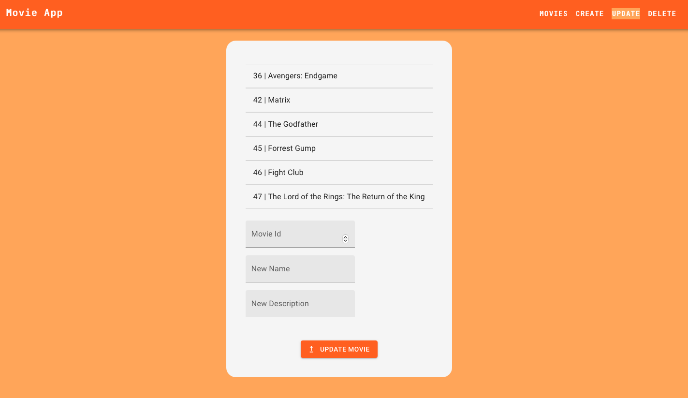

# Movie App
## _Made with ReactJs by Denizhan Aras_

Movie app is a basic website which stores user created movies. Homepage shows them to the user inside of cards. User can create, update and delete movies.

- Made with ReactJs.
- Front-end serves at localhost:3000
- Back-end can be found at [my spring movie app repository.](https://github.com/arasdenizhan/springMovieApp)
- Axios & MUI React component library were used.
- Check below for details.

## See all Movies
- Use **MOVIES** page. 
- Movies will be taken from the back-end.
- Every single movie shown up inside a Movie Card.

## Create a Movie
- Use **CREATE** page.
- A movie can easily be created with this page. 
- Be sure to fill all fields otherwise it is not possible to create a movie.

## Update a Movie
- Use **UPDATE** page.
- A movie can easily be updated with this page.
- Be sure to fill a valid Movie Id otherwise it is not possible to update a movie.
- You can leave the fields that you don't want to update empty.

## Delete a Movie
- Use **DELETE** page.
- A movie can easily be deleted with this page.
- Be sure to fill a valid Movie Id otherwise it is not possible to delete a movie.

